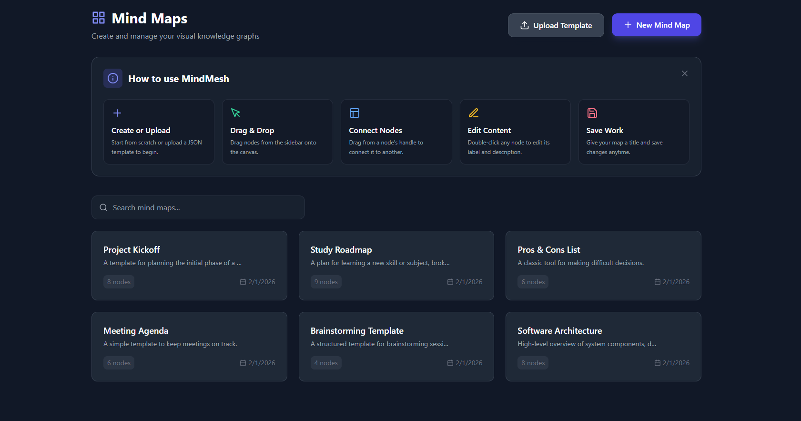
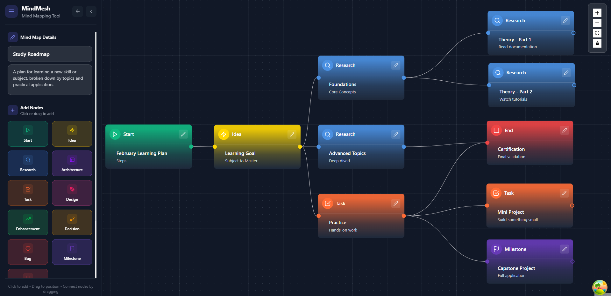
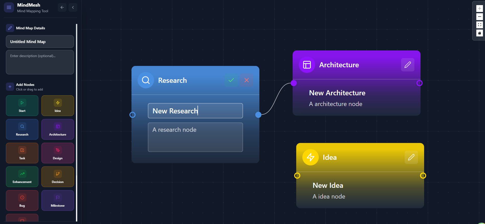
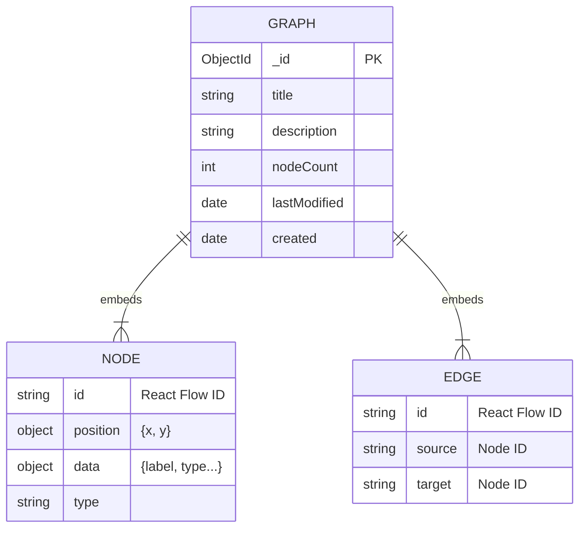

# MindMesh - Visual Knowledge Graph & Brainstorming Tool


## 🚀 Overview

**MindMesh** is an advanced interactive mind mapping and knowledge visualization platform aimed at helping users structure complex thoughts, relationships, and project architectures in a visual environment.

Built with a focus on performance and interactivity, MindMesh bridges the gap between creativity and technical structure. It allows users to create infinite nodes, connect them with semantic edges, and organize ideas into a cohesive visual graph. The project demonstrates a robust Full Stack implementation using **React Flow** for visualization, **Legend State** for fine-grained reactivity, and a backend with **Node.js** and **MongoDB**.

## 🌐 Live Demo

- **Status**: 🚧 Under Development / Run Locally
- **Deployment**: Coming Soon

---

## 📸 Screenshots

|                 Dashboard                 |             Template Gallery             |               Create Template                |
| :---------------------------------------: | :--------------------------------------: | :------------------------------------------: |
|  |  |  |
|      _Manage your knowledge graphs_       |    _Choose from predefined templates_    |              _Editor Interface_              |

---

## ✨ Key Features

- **🧠 Interactive Graph Editor**: Infinite canvas to create, drag, and connect nodes using **React Flow**.
- **⚡ High-Performance Reactivity**: Powered by **Legend State** for instant local updates and **React Query** for server synchronization.
- **🏷️ Smart Organization**: Tagging system and color-coded nodes for semantic grouping.

- **🎨 Modern Aesthetics**: Beautiful, accessible UI built with **Tailwind CSS** and **Framer Motion** animations.
- **🛠️ Full Stack Architecture**: Seamless integration between a React frontend and a robust Node.js/Express backend.

---

## 🛠️ Tech Stack

### Frontend (Client)

- **Framework**: React 19 + Vite
- **Language**: TypeScript (Strict Mode)
- **Visualization**: React Flow (Custom nodes, custom edges, interactive controls)
- **State Management**: Legend State (Local), React Query (Server), Context API
- **Styling**: Tailwind CSS + Tailwind Merge
- **Animations**: Framer Motion
- **Routing**: React Router v7

### Backend (Server)

- **Runtime**: Node.js
- **Framework**: Express.js
- **Database**: MongoDB Atlas (Mongoose ODM)
- **Architecture**: MVC + Service Layer
- **Validation**: Joi / Mongoose Middleware

---

## 🏗️ Architecture & Structure

The codebase follows **Domain-Driven Design (DDD)** principles to separate concerns and maintain scalability.

### Project Map

```
mindmesh/
├── src/ (Frontend)
│   ├── components/     # UI Building Blocks & React Flow Custom Components
│   ├── features/       # Feature-based modules (Editor, Dashboard)
│   ├── services/       # API integration & Business Logic
│   ├── state/          # Legend State observables
│   └── types/          # Shared TypeScript interfaces
├── backend/ (API)
│   ├── models/         # Mongoose Schemas (Data Layer)
│   ├── controllers/    # Request Handling (Interface Layer)
│   ├── services/       # Core Business Logic (Domain Layer)
│   └── routes/         # API Endpoint Definitions
```

### Design Patterns

- **Repository/Service Pattern**: Backend logic is isolated from HTTP handling in `services/`.
- **Custom Hooks**: specialized hooks like `useGraphActions`, `useAutoSave`, and `useNodes` encapsulate complex logic.
- **Optimistic UI**: The editor updates state immediately while syncing in the background for a "local-first" feel.
- **Component Composition**: specialized node types (`IdeaNode`, `TopicNode`) are composed into the graph engine.

---

## 🗄️ Database

The application uses **MongoDB** with **Mongoose** to store graph data. The data model uses a document-oriented approach where nodes and edges are embedded within the Graph document for atomic retrieval.

### Schema Diagram



---

## 🚀 Getting Started

### Prerequisites

- Node.js (v18+)
- MongoDB connection string (Local or Atlas)

### Installation

1. **Clone the repository**

   ```bash
   git clone https://github.com/GerganaR/mindmesh.git
   cd mindmesh/mindmesh
   ```

2. **Frontend Setup**

   ```bash
   npm install
   npm run dev
   ```

   ```

   ```

3. **Backend Setup**
   ```bash
   cd backend
   # Create .env file with MONGO_URI and PORT
   npm install
   npm run dev
   ```

### 🌍 Deployment

For detailed production deployment instructions (Render + Vercel), see **[DEPLOYMENT.md](./DEPLOYMENT.md)**.

## ⚙️ Environment Variables

To run this project, you will need to add the following environment variables to your `.env` files.

**Backend (`/backend/.env`)**

| Variable    | Description                 | Default |
| :---------- | :-------------------------- | :------ |
| `PORT`      | Port for the backend server | `5000`  |
| `MONGO_URI` | MongoDB connection string   | -       |

**Frontend (`/.env`)**

| Variable       | Description            | Default                     |
| :------------- | :--------------------- | :-------------------------- |
| `VITE_API_URL` | URL of the backend API | `http://localhost:5000/api` |

---

## 🔌 API Endpoints

The backend provides a RESTful API for managing knowledge graphs.

| Method   | Endpoint          | Description                  |
| :------- | :---------------- | :--------------------------- |
| `GET`    | `/api/graphs`     | Retrieve all saved graphs    |
| `GET`    | `/api/graphs/:id` | Get a specific graph by ID   |
| `POST`   | `/api/graphs`     | Create a new knowledge graph |
| `PUT`    | `/api/graphs/:id` | Update an existing graph     |
| `DELETE` | `/api/graphs/:id` | Delete a graph               |

---

## 🔮 Future Enhancements

- **🤝 Real-time Collaboration**: WebSocket integration for multi-user editing.
- **🤖 AI Brainstorming**: LLM integration to suggest related nodes and connections.
- **📱 Mobile Companion**: React Native app for capturing ideas on the go.
- **📤 Export Options**: Export graphs to PDF, Markdown, or JSON.

---

## 🤝 Contributing

Contributions are welcome! Please feel free to submit a Pull Request.

1. Fork the project
2. Create your Feature Branch (`git checkout -b feature/AmazingFeature`)
3. Commit your Changes (`git commit -m 'Add some AmazingFeature'`)
4. Push to the Branch (`git push origin feature/AmazingFeature`)
5. Open a Pull Request

---

## 📄 License

This project is licensed under the **ISC License**.

---

## 👤 Author

Built by **[Gergana Roshleva](https://github.com/GerganaR)**

---
